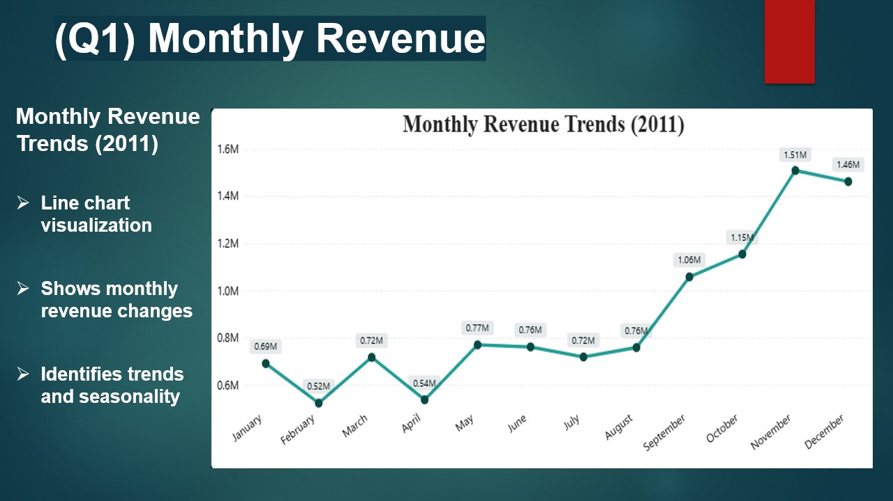
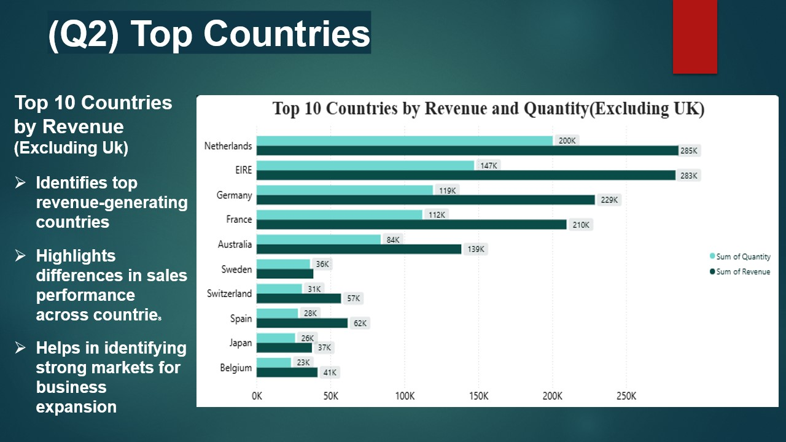
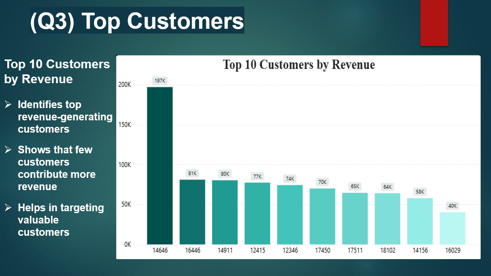

# 📊 Tata Data Visualisation — Virtual Internship

Completed "Data Visualisation: Empowering Business with 
Effective Insights" virtual internship by Tata Group via Forage.

---

## 📌 Project Overview

Analyzed a real-world retail dataset to create dashboards 
answering key business questions for the CEO and CMO.
Performed data cleaning, transformation, and visual storytelling 
to deliver actionable executive-level insights.

---

## ❓ Business Questions & Visual Answers

### Question 1 — Monthly Revenue Trends (CEO)
*"The CEO wants to view time series revenue data for 2011 
— monthly granular view to analyze seasonal trends and 
forecast for the next year."*

---

### Question 2 — Top 10 Countries by Revenue (CMO)
*"The CMO wants to view top 10 revenue-generating countries 
along with quantity sold — excluding United Kingdom."*

---

### Question 3 — Top 10 Customers by Revenue (CMO)
*"The CMO wants to identify highest revenue-generating 
customers in descending order to target and retain 
high-value customers."*

---

### Question 4 — Global Product Demand (CEO)
*"The CEO wants a single-view map of product demand across 
all countries (excluding UK) to identify regions with 
expansion opportunities."*

---

## 💡 Key Learnings
- Translated executive business questions into data-driven visuals
- Built CEO and CMO level dashboards using Power BI
- Strengthened skills in data cleaning, storytelling and dashboard design
- Identified seasonal trends, high-value customers and expansion regions

---

## Project Presentation

A detailed presentation summarizing the analysis, insights, 
and recommendations is included.
[Click here to view the project presentation](https://1drv.ms/p/c/FC376C6CA589819E/IQBCAqE41ieRRLd_0MmD7yxKAf1nlOn0d0GlwrwQIm-oho8?e=c1NzZ1)

## 🛠 Tools Used
Power BI • Excel • Data Cleaning • Data Visualisation • Data Storytelling

---

## 🏆 Certificate
Tata Data Visualisation: Empowering Business with 
Effective Insights — Forage (2026)

---

## 👩‍💻 Author
**Ishika Verma** — Data Analyst  
[LinkedIn](your linkedin link) | [GitHub](your github link)
